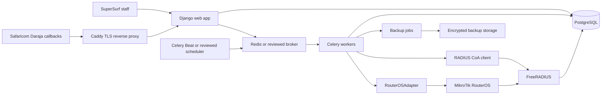
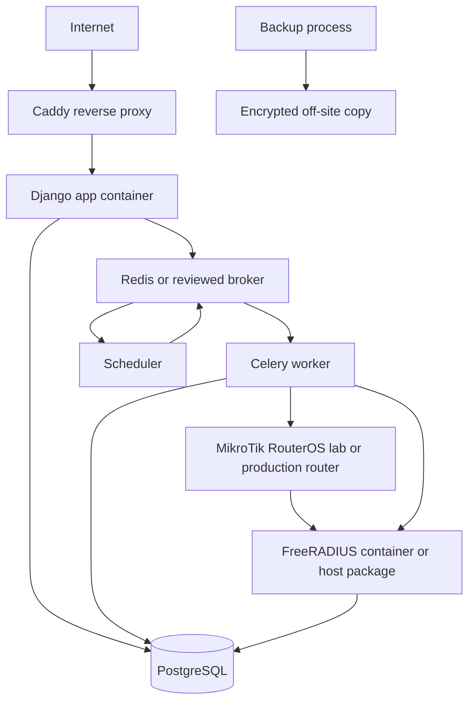
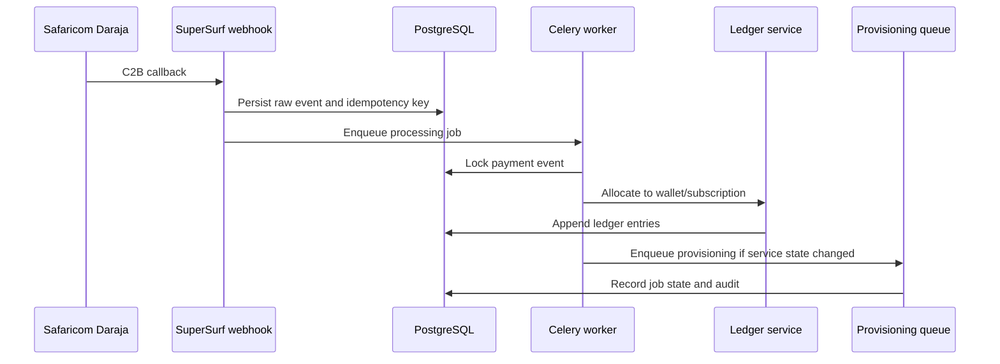
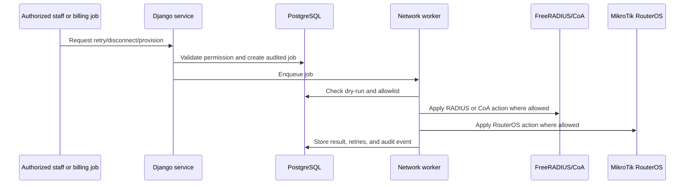

# Architecture Diagrams

## Component Diagram

```mermaid
flowchart LR
    Staff["SuperSurf staff"] --> Web["Django web app"]
    Web --> DB[("PostgreSQL")]
    Web --> Broker["Redis or reviewed broker"]
    Broker --> Worker["Celery workers"]
    Worker --> DB
    Scheduler["Celery Beat or reviewed scheduler"] --> Broker
    Mpesa["Safaricom Daraja callbacks"] --> Caddy["Caddy TLS reverse proxy"]
    Caddy --> Web
    Radius["FreeRADIUS"] --> DB
    Worker --> RadiusClient["RADIUS CoA client"]
    RadiusClient --> Radius
    Worker --> RouterAdapter["RouterOSAdapter"]
    RouterAdapter --> Router["MikroTik RouterOS"]
    Router --> Radius
    Backup["Backup jobs"] --> BackupStore["Encrypted backup storage"]
    Worker --> Backup
```

## Deployment Diagram

```mermaid
flowchart TB
    Internet["Internet"] --> Caddy["Caddy reverse proxy"]
    Caddy --> App["Django app container"]
    App --> Postgres[("PostgreSQL")]
    App --> Redis["Redis or reviewed broker"]
    Redis --> Celery["Celery worker"]
    Redis --> Beat["Scheduler"]
    Celery --> Postgres
    Beat --> Redis
    FreeRADIUS["FreeRADIUS container or host package"] --> Postgres
    MikroTik["MikroTik RouterOS lab or production router"] --> FreeRADIUS
    Celery --> MikroTik
    Celery --> FreeRADIUS
    Backup["Backup process"] --> Offsite["Encrypted off-site copy"]
```

## Payment Data Flow

```mermaid
sequenceDiagram
    participant Daraja as Safaricom Daraja
    participant Web as SuperSurf webhook
    participant DB as PostgreSQL
    participant Worker as Celery worker
    participant Ledger as Ledger service
    participant Network as Provisioning queue

    Daraja->>Web: C2B callback
    Web->>DB: Persist raw event and idempotency key
    Web->>Worker: Enqueue processing job
    Worker->>DB: Lock payment event
    Worker->>Ledger: Allocate to wallet/subscription
    Ledger->>DB: Append ledger entries
    Worker->>Network: Enqueue provisioning if service state changed
    Network->>DB: Record job state and audit
```

## Network Action Flow

```mermaid
sequenceDiagram
    participant User as Authorized staff or billing job
    participant App as Django service
    participant DB as PostgreSQL
    participant Worker as Network worker
    participant Radius as FreeRADIUS/CoA
    participant Router as MikroTik RouterOS

    User->>App: Request retry/disconnect/provision
    App->>DB: Validate permission and create audited job
    App->>Worker: Enqueue job
    Worker->>DB: Check dry-run and allowlist
    Worker->>Radius: Apply RADIUS or CoA action where allowed
    Worker->>Router: Apply RouterOS action where allowed
    Worker->>DB: Store result, retries, and audit event
```

