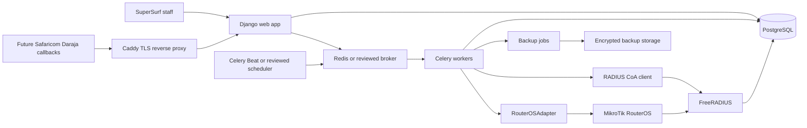
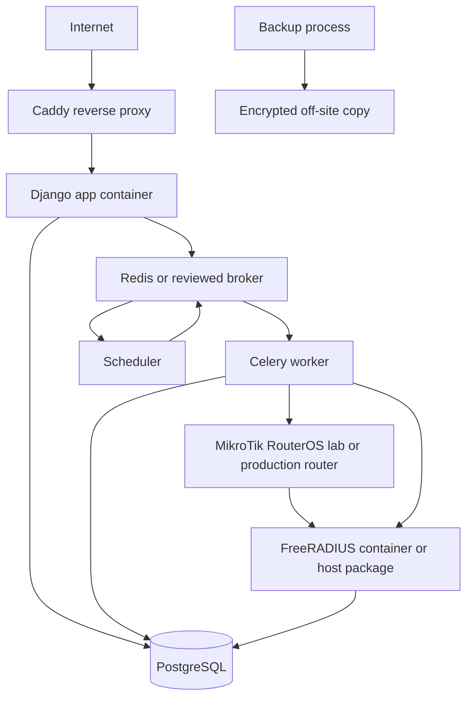
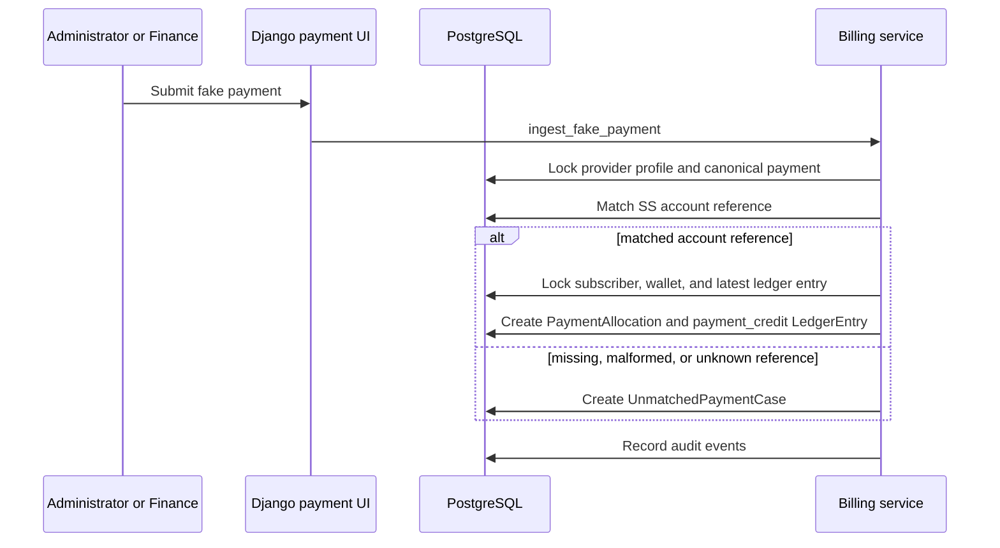
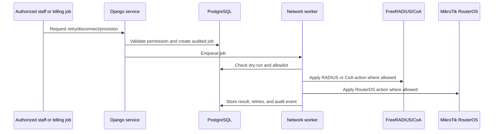

# Architecture Diagrams

## Component Diagram

## Deployment Diagram

## Phase 8 Fake Payment Data Flow

Future M-PESA, Paybill, or Till adapters should call the same canonical payment service only after Daraja sandbox evidence and provider-specific controls are reviewed.

## Network Action Flow

