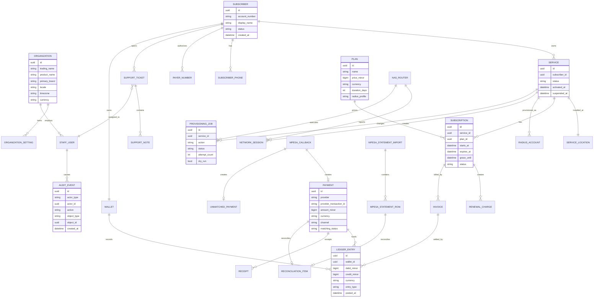

# Entity-Relationship Model

This is a Phase 0 logical model, not a production migration.

## Model Notes

- `Payment.provider_transaction_id` must be unique per provider.
- Ledger entries are append-only.
- Reversals create compensating entries.
- `UnmatchedPayment` keeps a link to the original callback and can later be manually resolved.
- `Service` exists separately from `Subscriber` to allow future multi-service customers without redesigning payments and network provisioning.
- RADIUS tables may include official FreeRADIUS tables alongside SuperSurf-owned service and provisioning tables.

