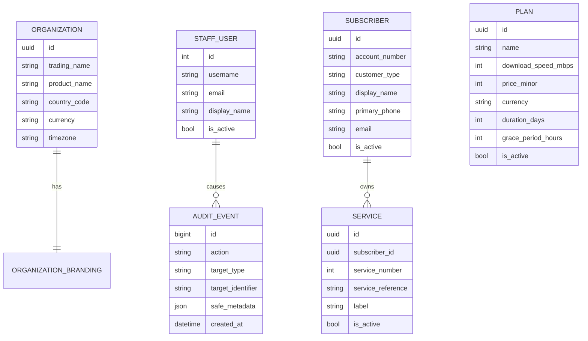
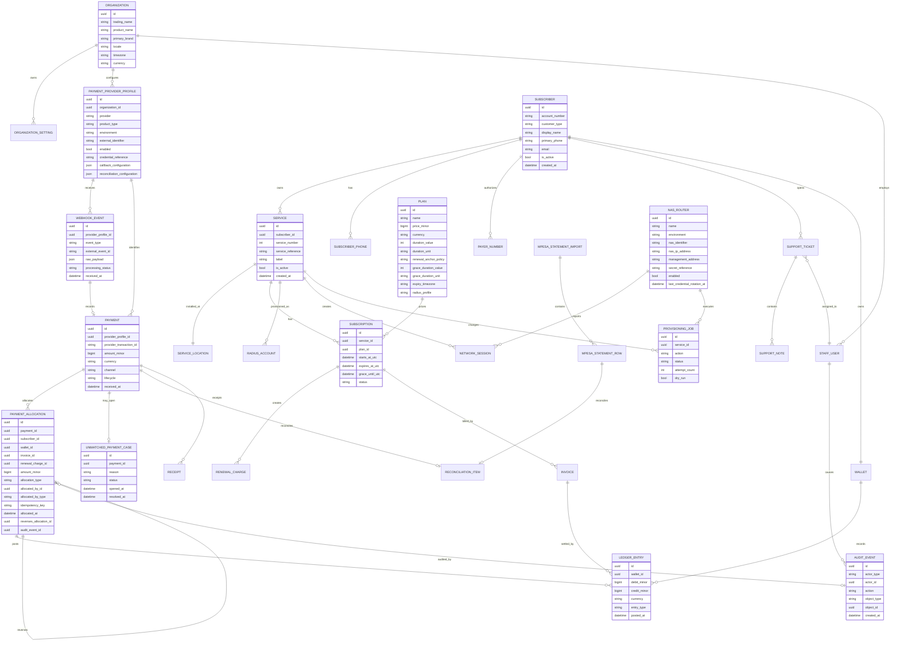

# Entity-Relationship Model

This is a Phase 0.5 logical model, not a production migration.

## Implemented Through Phase 3

`PLAN` is deliberately not connected to `SERVICE` in Phase 3. Package assignment, subscriptions, billing, PPPoE credentials, RADIUS, RouterOS, provisioning, payments, wallets, ledgers, installation, and equipment entities remain future work.

## Future Logical Model

## Payment Model Notes

- Every valid provider transaction creates one canonical `Payment`, even when it cannot yet be matched to a subscriber.
- `UnmatchedPaymentCase` is not an alternative to `Payment`; it is an optional case opened for a canonical payment.
- `PaymentAllocation` records allocation of payment value to a subscriber, wallet, invoice, or renewal charge.
- Allocations must not be mutated silently. Corrections require reversal or compensating allocation records linked through `reverses_allocation_id`.
- Payment lifecycle values should include `received`, `unmatched`, `partially_allocated`, `allocated`, `reversed`, `refunded_externally`, and `rejected` only when no valid financial transaction exists.
- Provider transaction identifiers are unique within a composite boundary such as `(provider_profile_id, environment, provider_transaction_id)`, not globally.
- A sandbox transaction must not collide with a production transaction.

## Provider Profile Notes

`PaymentProviderProfile` separates Paybill and Till products, sandbox and production environments, shortcode or Till identifier, enabled state, credential reference, callback configuration, and reconciliation configuration.

Credentials must not be stored directly in ordinary display fields. Store only encrypted secrets or secret-provider references.

## Plan Duration Notes

- Use `duration_value` and `duration_unit`, where unit can be `days`, `weeks`, or `calendar_months`.
- Thirty days is not always the same as one calendar month.
- Calendar-month renewal must define a renewal anchor policy and handle month-end dates.
- Persist timestamps in UTC.
- Perform business expiry and grace calculations in Africa/Nairobi.

## Network Notes

- Each NAS/router has its own shared secret or secret reference.
- Each NAS/router records NAS-Identifier, NAS-IP-Address or private management address, enabled state, lab or production environment, and last credential rotation time.
- Never display full RADIUS secrets after initial entry.
- RADIUS secrets must be encrypted or loaded through a secret provider.
- RADIUS tables may include official FreeRADIUS tables alongside SuperSurf-owned service and provisioning tables.
